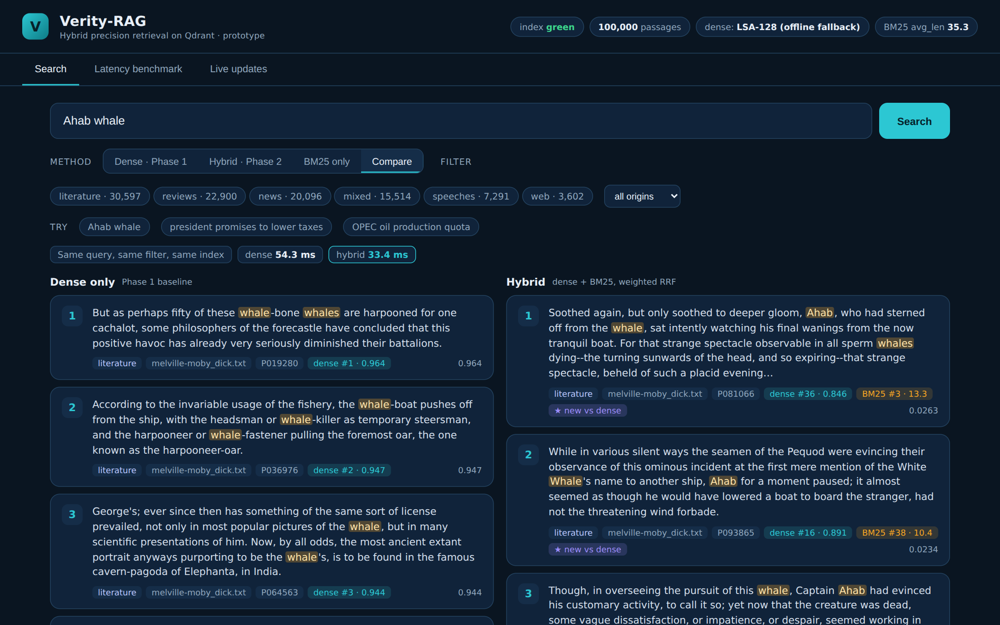

# Verity-RAG (prototype)

Hybrid (dense + BM25) precision retrieval on **Qdrant**, built for the ADROSONIC BUILD problem
*Vector Database Design for Large-Scale Precision Retrieval in RAG Systems*.



## What this prototype is, and is not

| Verified in the build environment | NOT verified there (no HuggingFace access) |
|---|---|
| Qdrant collection with named dense + sparse vectors (IDF modifier), payload indexes | MS MARCO loader (`iter_msmarco`), written to the HF v2.1 schema |
| 100,000 real passages indexed, dense + BM25 vectors, index green | `BGEEncoder` (BAAI/bge-small-en-v1.5) |
| Dense, BM25 and hybrid (weighted RRF) retrieval, per-leg ranks and scores | RAGAS evaluation, cross-encoder reranking, 500k scale (planned for the 24-hour build) |
| Filters applied inside Qdrant on both legs (tests: 0 violations, k still returned) | |
| Live upsert / delete without re-indexing | |
| 100-query latency benchmark with raw logs, ANN-vs-exact fidelity | |
| 15 unit / integration tests | |

**No retrieval-quality claims are made from this prototype.** The demo corpus is real text (NLTK: Gutenberg,
Reuters, Brown, movie reviews, speeches, web text) chunked into passages, and the dense encoder is an offline
TF-IDF+SVD (LSA-128) fallback, much weaker than a neural model. It exists to prove the *system*: architecture,
filters, live updates and latency at the 100k scale. Quality (RAGAS Context Precision / Recall) is measured on
MS MARCO with BGE in the full build.

## Measured (see `results/summary.json` and the raw per-query CSVs)

Hardware: Intel(R) Xeon(R) Processor @ 2.80GHz, **1 vCPU, 4.1 GB RAM**, Qdrant server and API sharing that one core.
Protocol: 20 warm-up queries excluded, then 100 distinct sequential queries, no cache, k=5, 100,000 passages.

| Mode | p50 | p95 | p99 | (HTTP end-to-end, ms) |
|---|---|---|---|---|
| BM25 only | 2.7 | 4.2 | 4.8 | |
| Dense only | 22.3 | 27.5 | 33.2 | |
| **Hybrid** | 28.7 | **44.4** | 44.9 | budget: 300 |

- Ingest of 100,000 passages: **97 s** with the offline encoder (a neural encoder will take much longer; measured in the full build).
- Measured BM25 `avg_len` = **35.3** stemmed tokens (the commonly used default of 256 would mis-normalise short passages).
- HNSW vs exact search, overlap@5 = **0.978** over 120 queries (the one 0.0 is a stopword-only query that encodes to a zero vector).
- Live updates: 15 upserts averaged **22 ms**; deletes restored the exact point count and removed them from results.
  Under equal-weight RRF a fresh rare-term passage is in the top 5 for 14/15 probes; with `w_sparse=2` for 15/15
  (`results/summary.json`). This is why fusion weights are configurable and tuned on a dev split in the full build.

## Quickstart

```bash
pip install -r requirements.txt
docker compose up -d                                   # Qdrant (or run the qdrant binary)
python -c "import nltk; [nltk.download(c) for c in ['gutenberg','brown','reuters','webtext','inaugural','state_union','movie_reviews']]"
python scripts/build_index.py --dataset demo --n 100000 --recreate
PYTHONPATH=src uvicorn verity.api:app --port 8000      # open http://localhost:8000
python scripts/bench_latency.py                        # writes results/*.csv and summary.json
python -m pytest -q tests                              # 15 tests
```

### Real MS MARCO + BGE (needs HuggingFace access)

```bash
pip install -r requirements-bge.txt
python -m verity.datasets --dataset msmarco --peek     # check the loader on first run
python scripts/build_index.py --dataset msmarco --encoder bge --n 100000 --recreate
```

## Design notes
- **BM25 inside the vector database.** Documents are stored with a BM25-weighted sparse vector in a collection created
  with the IDF modifier, so IDF is computed by Qdrant on the live corpus: correct after upserts and deletes, and the
  lexical leg obeys the same payload filter as the dense leg.
- **Weighted RRF** (`src/verity/fusion.py`): `score(d) = sum_leg w_leg / (rrf_k + rank_leg(d))`; weights and `rrf_k` in `configs/default.yaml`.
- **Filters** (`category`, `source`, `origin`, `ingested_at` range) are payload-indexed and passed to both legs; nothing is filtered in Python.
- **Encoders are pluggable** (`DenseEncoder` protocol): LSA (offline) or BGE-small.

## Known behaviour (honest notes)
- Hybrid is not universally better. On the query "OPEC oil production quota" the fused top-1 is arguably weaker than BM25's own top result, because RRF favours documents that appear in both lists.
- With equal weights and a weak dense encoder, rare-term matches can be outvoted by documents present in both lists; see the live-update probe above.

## Repo map
`src/verity/` config, text (BM25 sparse encoder), encoders, store (Qdrant), fusion, retrieval, metrics, datasets, api, web UI · `scripts/` build_index, bench_latency · `tests/` · `results/` raw logs · `docs/` architecture and screenshots.
