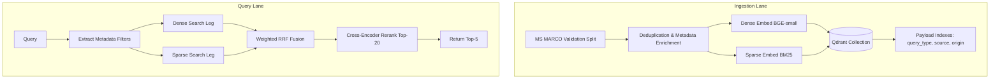

# Architecture

Verity-RAG uses a hybrid dense and sparse retrieval approach over a single Qdrant index.

```mermaid
graph TD
    subgraph "Ingestion Lane"
        A[MS MARCO Validation Split] --> B[Deduplication & Metadata Enrichment]
        B --> C[Dense Embed BGE-small]
        B --> D[Sparse Embed BM25]
        C --> E[(Qdrant Collection)]
        D --> E
        E --> F[Payload Indexes: query_type, source, origin]
    end

    subgraph "Query Lane"
        Q[Query] --> G[Extract Metadata Filters]
        G --> H[Dense Search Leg]
        G --> I[Sparse Search Leg]
        H --> J[Weighted RRF Fusion]
        I --> J
        J --> K[Cross-Encoder Rerank Top-20]
        K --> L[Return Top-5]
    end
```
